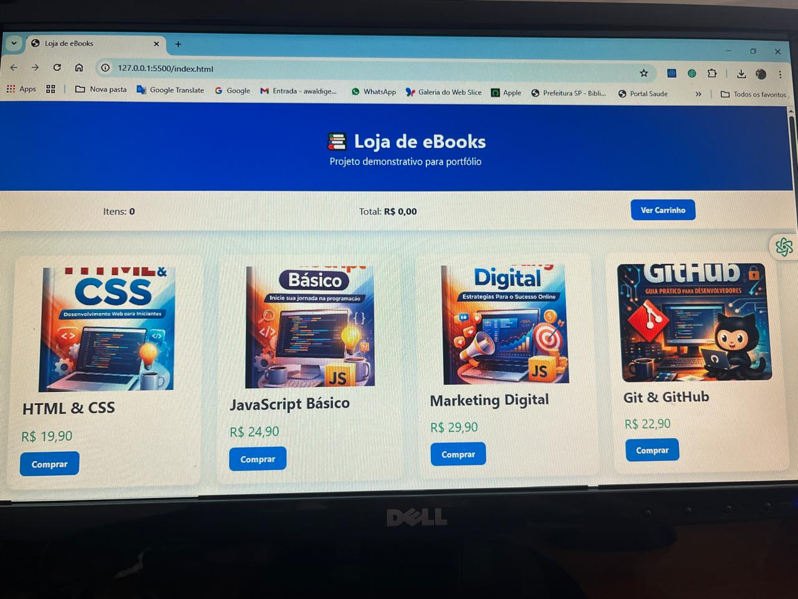

# 📚 Loja de eBooks - Projeto Demonstrativo

Projeto de front-end desenvolvido com **HTML, CSS e JavaScript puro**, simulando uma loja de eBooks.

## 🚀 Funcionalidades
- Catálogo dinâmico com paginação
- Carrinho de compras com controle de quantidade
- Persistência de dados com LocalStorage
- Modal de checkout
- Simulação de pagamento (Pix e Mercado Pago)
- Loading animado
- Toast de feedback
- Liberação de download após compra
- Animações modernas e layout responsivo

## 🛠️ Tecnologias
- HTML5
- CSS3
- JavaScript (Vanilla JS)

## 📸 Demonstração

## 📌 Observação
Este projeto é **apenas para fins de estudo e portfólio**.  
Não realiza pagamentos reais.

## 👤 Autor
André Waldige

