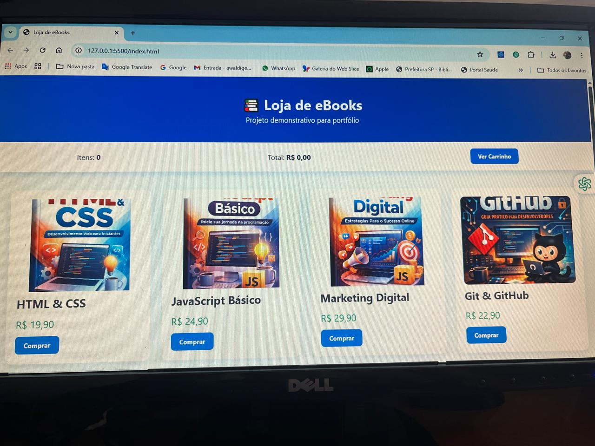
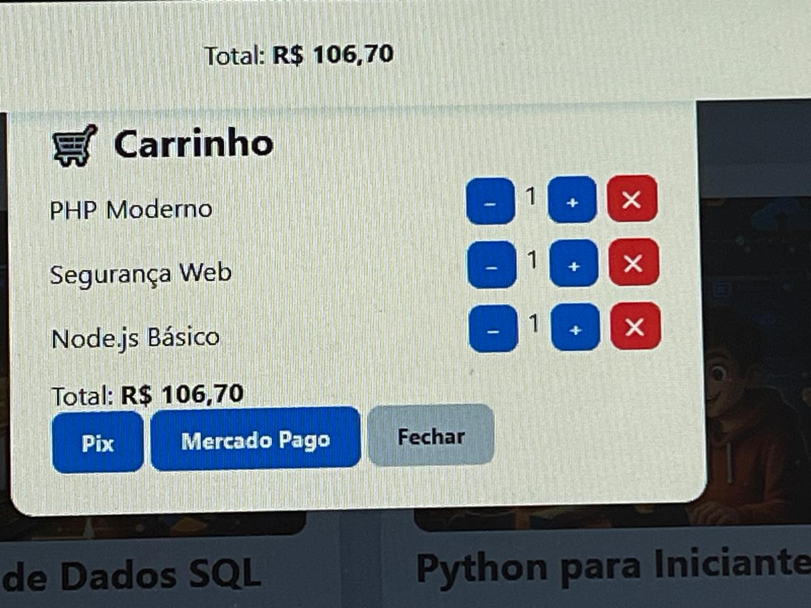
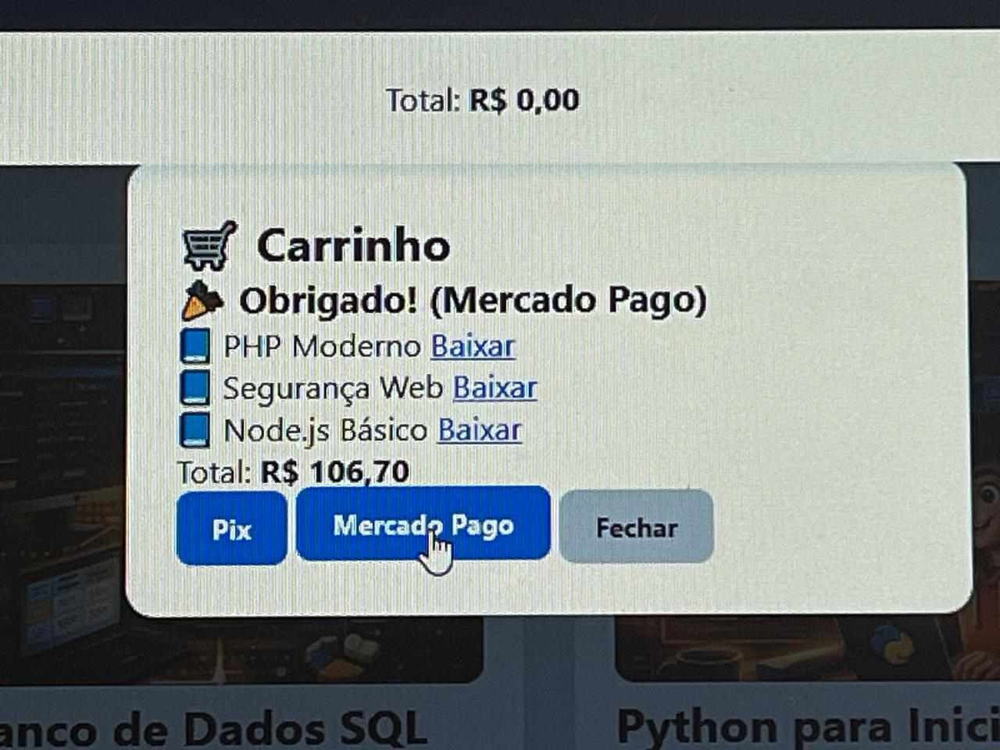

# 📚 Loja de eBooks • Projeto Demonstrativo

Aplicação front-end que simula uma **loja online de eBooks**, desenvolvida com **HTML, CSS e JavaScript puro**, focada em experiência do usuário, navegação fluida e simulação completa de fluxo de compra.

O projeto demonstra funcionalidades comuns de e-commerce, como catálogo, carrinho, checkout e feedback visual ao usuário, sem depender de backend.

---

## 🚀 Demo do Projeto


🔗 Demo: https://lojaebooks.vercel.app/

---

## ✨ Funcionalidades

- ✔ Catálogo dinâmico de eBooks
- ✔ Paginação de produtos
- ✔ Carrinho de compras com controle de quantidade
- ✔ Persistência do carrinho via LocalStorage
- ✔ Modal de checkout
- ✔ Simulação de pagamento (Pix e Mercado Pago)
- ✔ Liberação de download após compra
- ✔ Toast de feedback ao usuário
- ✔ Loading animado durante compra
- ✔ Interface moderna e responsiva
- ✔ Experiência semelhante a lojas virtuais reais

---

## 🛠️ Tecnologias Utilizadas

- **HTML5** — Estrutura semântica
- **CSS3** — Layout responsivo e animações modernas
- **JavaScript (Vanilla)** — Lógica e interações
- **LocalStorage** — Persistência de dados no navegador

---

## 🖼️ Demonstração

### 🏠 Página Inicial
<p align="center">
  
</p>

### 🛒 Carrinho de Compras
<p align="center">
  
</p>

### 💳 Simulação de Pagamento
<p align="center">
  
</p>

---

## 📂 Estrutura do Projeto

ebook-store/
│
├── index.html
├── style.css
├── script.js
├── prints/
└── README.md


---

## 📌 Como Executar

Clone o repositório:

```bash
git clone https://github.com/awaldige/loja-ebooks.git
Abra o arquivo index.html em qualquer navegador.

Não é necessário backend ou servidor.

🧠 Destaques Técnicos
Carrinho mantido entre sessões via LocalStorage

Fluxo completo de compra simulado

Interface focada em UX

Componentes reutilizáveis

Feedback visual constante ao usuário

Código organizado e fácil de evoluir

🔮 Melhorias Futuras
Integração com API de pagamentos real

Sistema de usuários

Área de downloads do cliente

Backend para controle de pedidos

Painel administrativo

Sistema de cupons e descontos

⚠️ Observação
Este projeto é apenas demonstrativo, criado para estudo e portfólio.

Nenhum pagamento real é processado.

👨‍💻 Autor
Desenvolvido por André Waldige
🔗 GitHub: https://github.com/awaldige

Projeto voltado para estudo e portfólio profissional.
